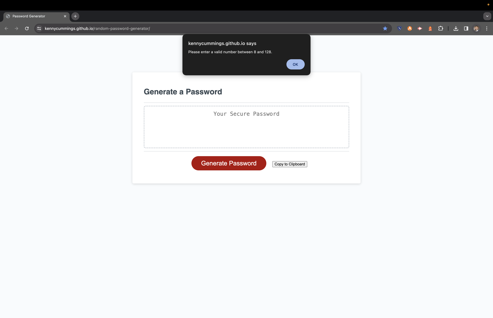
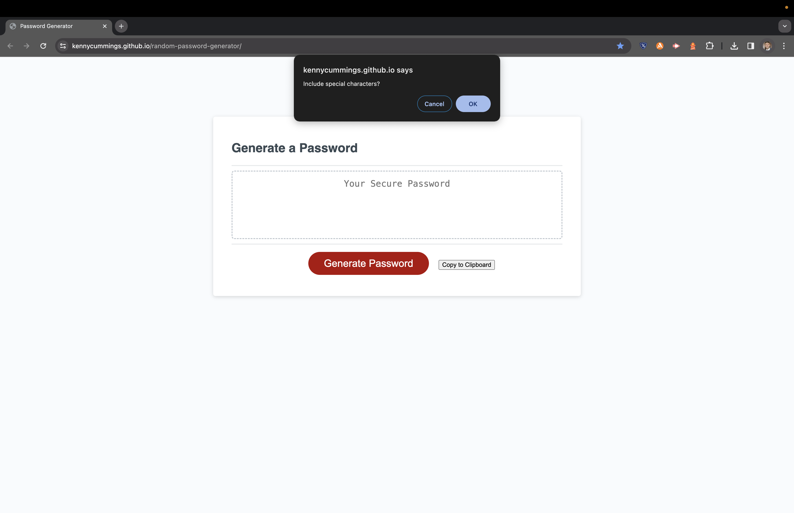
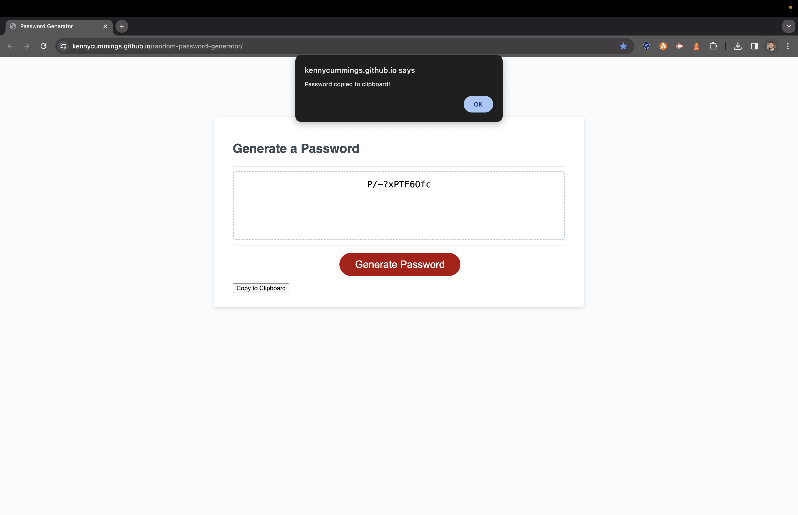

# random-password-generator
Random password generator created using JavaScript

The purpose of this project is to get comfortable with JavaScript in the form of assinging variables and creating loops. This is something I would like to improve upon. I have no JavaScript experience prior to the UPenn bootcamp. I am excited to get my feet wet!

I started the project using this logic:

<ul>
<li>User input: presses generate password button</li>
<li>Window popup: "How many characters would you like your password to be? Choose between 8 and 128 characters."</li>
<li>Prompts: lowercase, uppercase, numeric, and/or special characters</li>
<li>Generate a password within said parameters</li>
<li>Diplay said password</li>
<li>Optional: copy to clipboard button</li>
</ul>

This helped me organize my thoughts, and what must be done in what order. This was important for the random password generator to function. First, I added an event listener, so when the button is clicked, the 'writePassword" funciton will be called. I then defined the 'writePassword' function. Next, I created a prompt to specify password length and stored 'length' as a variable. Afterwards, I validated and santized the input, so that the if the number input isn't between 8 and 128 characters, then an alert is displayed. Then, I coded prompts for lowercase, upercase, numeric, and special characters. A loop was used to randomly pick characters. I added a copy to clipboard button because I thought it was a neat addition! I updated the HTML accordingly.

URL: https://kennycummings.github.io/random-password-generator/

 

 
 

 
 

 
 

 
 

 
 

 
 

